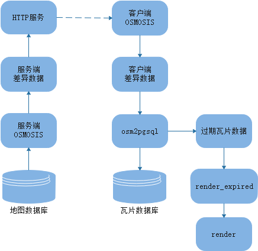

# 说明
- 本同步方案结合多个文档得出，很可能有更好的方案   
	- [保持本地瓦片数据与OSM同步](https://ircama.github.io/osm-carto-tutorials/updating-data/)
	- [编辑地图数据时更新瓦片数据库](https://wiki.openstreetmap.org/wiki/User:SomeoneElse/Ubuntu_1604_tileserver_load#Updating_your_database_as_people_edit_OpenStreetMap)
	- [osmosis replication](https://wiki.openstreetmap.org/wiki/Osmosis/Replication)
	- [osmosis使用](http://www.hanchao.name/osmosis/osm/2016/10/08/osmosis_usage/)
	- [过期瓦片](https://wiki.openstreetmap.org/wiki/Tile_expire_methods)  
- 本文档认为已按照[搭建地图编辑器文档](./搭建官网website-地图编辑.md)和[搭建瓦片服务器](./搭建瓦片服务器.md)搭建地图编辑website和瓦片服务器

## 数据同步流程

   

数据同步流程如上图

* 服务端osmosis定期从地图数据库中导出差异数据到本地，供外部下载
* HTTP服务响应外部获取差异数据请求
* 客户端osmosis定期向服务器请求差异数据
* 下载到的差异数据通过osm2pgsql导入瓦片数据库，同时生成已过期的瓦片数据
* 通过render_expired命令告知render瓦片已过期，需要重新渲染

# 安装

## JDK(osmosis需要)
**自行安装**  

## osmosis
[查询最新版的osmosis](https://wiki.openstreetmap.org/wiki/Osmosis#Latest_stable_version)
```
wget https://bretth.dev.openstreetmap.org/osmosis-build/osmosis-latest.tgz
mkdir /var/lib/osmosis
tar xvfz osmosis-latest.tgz -C /var/lib/osmosis
ln -s /var/lib/osmosis/bin/osmosis /usr/local/bin/osmosis
```

## nginx
* 服务端需要对外提供replication数据   
* 原计划使用已安装的httpd服务，但经过实践，mod_tile会捕捉所有请求，即使和它不相干。不管问题根源，改用nginx。

```
yum install nginx
```

# 配置服务端
osmosis详细命令参考[文档](https://wiki.openstreetmap.org/wiki/Osmosis/Detailed_Usage_0.46)

## 生成replication数据
```
mkdir /root/osm/replication
cd replication
```

**定义数据库配置文件auth.conf**  
文件内容如下  
```
host=127.0.0.1
database=osm
user=postgres
password=123456
dbType=postgresql
```

**定时导出修改内容**  
```
mkdir -p server/minute

nohup osmosis --replicate-apidb authFile=/root/osm/replication/auth.conf allowIncorrectSchemaVersion=true iterations=0 maxInterval=1800000 minInterval=60000 --write-replication workingDirectory=/root/osm/replication/server/minute & disown

# iterations, 复制操作次数，0表示无限次
# minInterval, 两次复制间间隔最小毫秒数
# maxInterval, 没有数据修改的情况下，两次复制间间隔最大毫秒数
# 服务停止重新开始前需要先删除/root/osm/replication/server/minute/replicate.lock文件
```

## 使用nginx对外提供replication数据
**创建服务**   
```
vi /etc/nginx/nginx.conf
	# 添加以下内容(注意端口冲突和防火墙)
    server {
        listen 8181;
        root /root/osm/replication/server/;
		
        location /replication/ {
            alias /root/osm/replication/server/;
        }
    }

systemctl enable nginx
systemctl start nginx
```

**解决SELinux问题**   
vi nginx.te，添加以下内容   
nginx.te的内容是每次nginx启动、请求资源失败时执行命令下面命令获得   
`grep nginx /var/log/audit/audit.log | audit2allow -m nginx > nginx.te`
```
module nginx 1.0;

require {
        type admin_home_t;
        type httpd_t;
        type intermapper_port_t;
        class tcp_socket name_bind;
        class file { getattr open read };
}

#============= httpd_t ==============
allow httpd_t admin_home_t:file getattr;
allow httpd_t admin_home_t:file { open read };
allow httpd_t intermapper_port_t:tcp_socket name_bind;
```

**添加策略**  
```
checkmodule -M -m -o nginx.mod nginx.te
semodule_package -m nginx.mod -o nginx.pp 
semodule -i nginx.pp
```

**验证服务**
```
wget http://localhost:8181/replication/minute/state.txt
```

# 配置客户端
## 初始化replication目录

```
mkdir -p /root/osm/replication/client
osmosis --read-replication-interval-init workingDirectory=/root/osm/replication/client
```

**修改replication服务配置**  
```
vi /root/osm/replication/client/configuration.txt
	# 修改baseUrl。当前编辑和渲染在同一服务器
	baseUrl=http://localhost:8181/replication/minute

cd /root/osm/replication/client
# 每次客户端同步时都会根据自己的数据情况请求replication数据
# 这些数据保存在replication目录的state.txt文件中
# state.txt需要手动添加，replication目录的初始化不会生成state.txt
# 可根据实际情况获取需要的state.txt文件

# 如已服务端当前最新的state.txt作为自己的state.txt
wget http://localhost:8181/replication/minute/state.txt

# 或按服务端开始提供replication数据的state.txt作为自己的state.txt
wget http://localhost:8181/replication/minute/000/000/000.state.txt -O state.txt

# 其他选择合适的state.txt
```

## 数据同步脚本
vi /root/osm/replication/client/sync-map-data-2-tile-db.sh
```
#!/bin/bash

now=`date`
echo "------------ start at: $now ------------------"

export LD_LIBRARY_PATH=$LD_LIBRARY_PATH:/usr/local/lib/
export REPLICATION_CLIENT_DIR=/root/osm/replication/client
export PGHOST=127.0.0.1
export PGUSER=postgres
export PGPASSWORD=123456
TILES_DB=tiles
CHANGE_FILE=$REPLICATION_CLIENT_DIR/changes.osc.gz
EXPIRY_MINZOOM=13
EXPIRY_METAZOOM=15-17
EXPIRY_FILE=$REPLICATION_CLIENT_DIR/dirty_tiles

cd /root/osm/openstreetmap-carto-4.13.0
rm $EXPIRY_FILE

# 从服务端获取差异数据
/usr/local/bin/osmosis --read-replication-interval workingDirectory=${REPLICATION_CLIENT_DIR} --simplify-change --write-xml-change $CHANGE_FILE

# 导入差异数据并统计出过期的瓦片
/usr/local/bin/osm2pgsql --append --slim --expire-tiles $EXPIRY_METAZOOM --expire-output $EXPIRY_FILE -C 300 -G --hstore --style openstreetmap-carto.style --tag-transform-script openstreetmap-carto.lua -d $TILES_DB -H $PGHOST -U $PGUSER $CHANGE_FILE

# 通知render瓦片已超时，用户请求瓦片时会返回旧瓦片，并渲染新瓦片
#/usr/local/bin/render_expired --min-zoom=$EXPIRY_MINZOOM --touch-from=$EXPIRY_MINZOOM -s /var/run/renderd/renderd.sock < "$EXPIRY_FILE"

# 删除就瓦片数据
/usr/local/bin/render_expired --min-zoom=$EXPIRY_MINZOOM --delete-from=$EXPIRY_MINZOOM -s /var/run/renderd/renderd.sock < "$EXPIRY_FILE"

now=`date`
echo "------------ end at: $now ------------------"
echo "--------------------------------------------"
echo ""
echo ""
```

## 注册定时任务
* 上述的同步脚本只会执行一次
* 这里结合crontab发起定时数据同步任务

```
crontab -e
	# 添加下述内容
	# 每分钟同步一次
	* * * * * /root/osm/replication/client/sync-data.sh >>  /root/osm/replication/client/sync-logs/`date +'\%Y\%m\%d'`.log 2>&1
```

# 可能遇到问题
## 服务端生成大量小replication文件
* osmosis生成replication文件逻辑参考`org.openstreetmap.osmosis.apidb.v0_6.impl.Replicator.java`   
* `replicateImpl`方法中判断是否有内容更新实际上只是比较transactionId变化，和内容无关   
* 而比较条件是`state.getTxnMaxQueried() != state.getTxnMax()`, 条件为真，说明数据有变化   
* 各种实践得出的结论是上述条件总是为真的   
* 这样导致的结果是，经过`minInterval`后，一定触发导出replication逻辑，`maxInterval`无效   
* 为解决该问题，修改了下上述条件，改为`Math.abs(state.getTxnMax() - state.getTxnMaxQueried()) > 10`  