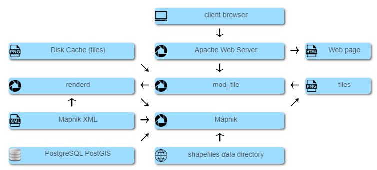

# 说明
* 安装过程参考[教程1](https://www.keisan.io/en/knowledgebase/centos-7-open-street-map-tile-server)和[教程2](https://switch2osm.org/serving-tiles/manually-building-a-tile-server-14-04/)  
* 本文档认为已按照[搭建地图编辑器文档](./搭建官网website-地图编辑.md)上安装并配置好PostgresSQL  
* 本文搭建的瓦片数据库名字为<font color="red">tiles</font>，配置上需要注意

## 瓦片服务主要组件
* PostgresSQL/PostGIS - 瓦片数据库    
* osm2pgsql - 将地图数据导入到瓦片数据库  
* Apache - 响应瓦片HTTP请求  
* Mod_tile - Apache的扩展模块，负责响应瓦片请求的实际工作  
* renderd - 响应并调度瓦片渲染任务，调用Mapnik渲染瓦片图片  
* Mapnik - 从数据库获取数据，并生成瓦片图片
* openstreetmap-carto - 定义了瓦片的样式，地图数据如何导入到数据库，如何从数据库查询数据
  

瓦片渲染流程如上图

# 安装

## 依赖一坨
```
yum install bzip2-devel libpng-devel libtiff-devel zlib-devel libjpeg-devel libxml2-devel python-setuptools proj-devel proj proj-epsg proj-nad freetype-devel freetype libicu-devel libicu gdal-devel gdal sqlite-devel sqlite libcurl-devel libcurl cairo-devel cairo pycairo-devel pycairo geos geos-devel protobuf-devel protobuf-c-devel lua-devel boost boost-thread boost-devel cmake make gcc-c++ expat-devel xorg-x11-font-utils fontconfig

yum install centos-release-scl 
yum install devtoolset-6
scl enable devtoolset-6 bash

yum install nodejs
```

## Boost C++
```
JOBS=`grep -c ^processor /proc/cpuinfo`
wget http://downloads.sourceforge.net/boost/boost_1_63_0.tar.bz2
tar xf boost_1_63_0.tar.bz2
cd boost_1_63_0

./bootstrap.sh
./b2 -d1 -j${JOBS} --with-thread --with-filesystem --with-python --with-regex -sHAVE_ICU=1 --with-program_options --with-system link=shared release toolset=gcc stage
./b2 -d1 -j${JOBS} --with-thread --with-filesystem --with-python --with-regex -sHAVE_ICU=1 --with-program_options --with-system link=shared release toolset=gcc install

sudo bash -c "echo '/usr/local/lib' > /etc/ld.so.conf.d/boost.conf"
sudo ldconfig
```

## osm2pgsql 
用于将OSM数据导入到数据库的工具
```
wget https://github.com/openstreetmap/osm2pgsql/archive/0.96.0.zip
unzip 0.96.0.zip
mkdir osm2pgsql-0.96.0/build
cd osm2pgsql-0.96.0/build
cmake -DCMAKE_BUILD_TYPE=Release ..
make
make install
```

## Harfbuzz
文字渲染库
```
wget http://www.freedesktop.org/software/harfbuzz/release/harfbuzz-0.9.34.tar.bz2
tar xf harfbuzz-0.9.34.tar.bz2
cd harfbuzz-0.9.34
./configure && make
make install
ldconfig
```

## mapnik
地理数据图片渲染库
```
git clone --branch v3.0.20 https://github.com/mapnik/mapnik.git
cd mapnik
git submodule update --init deps/mapbox/variant

./configure ENABLE_LOG=True DEBUG=False ENABLE_STATS=True DEFAULT_LOG_SEVERITY=warn

## make的时候可能会出错，再来一次就好了
make 
make install 
ldconfig
```

## carto
地图样式
```
npm install -g carto@0

wget https://github.com/gravitystorm/openstreetmap-carto/archive/v4.13.0.zip
unzip v4.13.0.zip
cd openstreetmap-carto-4.13.0
mkdir data
cd data

wget https://planet.openstreetmap.org/historical-shapefiles/world_boundaries-spherical.tgz
wget http://data.openstreetmapdata.com/simplified-land-polygons-complete-3857.zip
wget http://www.naturalearthdata.com/http//www.naturalearthdata.com/download/110m/cultural/ne_110m_admin_0_boundary_lines_land.zip
wget http://data.openstreetmapdata.com/land-polygons-split-3857.zip
wget http://data.openstreetmapdata.com/antarctica-icesheet-polygons-3857.zip
wget http://data.openstreetmapdata.com/antarctica-icesheet-outlines-3857.zip

tar xvf world_boundaries-spherical.tgz
unzip simplified-land-polygons-complete-3857.zip
unzip land-polygons-split-3857.zip
unzip antarctica-icesheet-polygons-3857.zip
unzip antarctica-icesheet-outlines-3857.zip
unzip ne_110m_admin_0_boundary_lines_land.zip -d ne_110m_admin_0_boundary_lines_land

LD_LIBRARY_PATH=/usr/local/lib
export LD_LIBRARY_PATH
shapeindex land-polygons-split-3857/land_polygons.shp
shapeindex simplified-land-polygons-complete-3857/simplified_land_polygons.shp
shapeindex ne_110m_admin_0_boundary_lines_land/ne_110m_admin_0_boundary_lines_land.shp
shapeindex antarctica-icesheet-outlines-3857/icesheet_outlines.shp
shapeindex antarctica-icesheet-polygons-3857/icesheet_polygons.shp
```

## httpd + mod_tile
```
yum install httpd httpd-devel

git clone --depth=1 https://github.com/openstreetmap/mod_tile.git
cd mod_tile
./autogen.sh
./configure
make && make install && make install-mod_tile && ldconfig
```

## 字体
```
mkdir /usr/local/lib/mapnik/fonts/Noto
git clone --depth=1 https://github.com/googlei18n/noto-fonts.git
cp noto-fonts/hinted/*.ttf /usr/local/lib/mapnik/fonts/Noto

git clone --depth=1 https://github.com/googlei18n/noto-emoji.git
cp noto-emoji/fonts/*.ttf /usr/local/lib/mapnik/fonts/Noto

git clone --depth=1 https://github.com/googlei18n/noto-cjk.git
unzip noto-cjk/NotoSansCJK.ttc.zip -d /usr/local/lib/mapnik/fonts/Noto
```

# 配置

## 配置carto
carto的project.mml文件定义了数据源，需要在此设定数据库配置

```
cd openstreetmap-carto-4.13.0
vi project.mml
```

在osm2pgsql中添加port/host/user/password参数，大概长这样  
```
osm2pgsql: &osm2pgsql
    type: "postgis"
    dbname: "tiles"
    port: "5432"
    host: "127.0.0.1"
    user: "postgres"
    password: "123456"
    key_field: ""
    geometry_field: "way"
    extent: "-20037508,-20037508,20037508,20037508"
```

生成样式文件
```
carto project.mml > style.xml
```

## 配置renderd
```
vi /usr/local/etc/renderd.conf


	# 修改mapnik插件路径，可通过命令`mapnik-config --input-plugins`获取
	plugins_dir=/usr/local/lib/mapnik/input

	# 修改字体目录
	font_dir=/usr/local/lib/mapnik/fonts
	font_dir_recurse=true

	# 修改样式/HOST
	XML=/root/osm/openstreetmap-carto-4.13.0/style.xml
	HOST=localhost
```

配置大概长这样
```
[renderd]
;socketname=/var/run/renderd/renderd.sock
num_threads=4
tile_dir=/var/lib/mod_tile
stats_file=/var/run/renderd/renderd.stats


[mapnik]
plugins_dir=/usr/local/lib/mapnik/input
font_dir=/usr/local/lib/mapnik/fonts
font_dir_recurse=1

[default]
URI=/osm_tiles/
TILEDIR=/var/lib/mod_tile
XML=/root/osm/openstreetmap-carto-4.13.0/style.xml
HOST=localhost
TILESIZE=256
MINZOOM=0
MAXZOOM=20
;TYPE=png image/png
```

## 配置mod_tile
```
vi /etc/httpd/conf.d/mod_tile.conf

# 内容大概如下
LoadModule tile_module /etc/httpd/modules/mod_tile.so
<VirtualHost *:80>
    # ServerName tiles.lvji.com
    # ServerAlias a.tiles.lvji.com b.tiles.lvji.com c.tiles.lvji.com d.tiles.lvji.com
    DocumentRoot /var/www/html
	
    LogLevel debug

    ModTileTileDir /var/lib/mod_tile
    LoadTileConfigFile /usr/local/etc/renderd.conf
	ModTileRenderdSocketName /var/run/renderd/renderd.sock
	# ModTileRenderdSocketAddr renderd.mydomain.com 7653
	
    ModTileEnableStats On
	ModTileBulkMode Off
	
    ModTileRequestTimeout 3
    ModTileMissingRequestTimeout 10
    ModTileMaxLoadOld 16
    ModTileMaxLoadMissing 50
    ModTileVeryOldThreshold 31536000000000
	
    ModTileCacheDurationMinimum 0
    ModTileCacheDurationMax 0
    ModTileCacheDurationDirty 0
    ModTileCacheDurationMediumZoom 13 300
    ModTileCacheDurationLowZoom 9 600
    ModTileCacheLastModifiedFactor 0.20

    # ModTileEnableTileThrottling Off
    # ModTileEnableTileThrottlingXForward 0
    # ModTileThrottlingTiles 10000 1
    # ModTileThrottlingRenders 128 0.2

</VirtualHost>
```

# 瓦片数据准备
## 创建数据库
```
su - postgres
psql
postgres=# CREATE DATABASE tiles WITH ENCODING = 'UTF8';
postgres=# \c tiles;
tiles=# CREATE EXTENSION postgis;
tiles=# CREATE EXTENSION hstore;
tiles=# \q
exit
```

## 导入地图数据
```
# 假设地图数据为/root/osm/osm-web-data/guangzhou.osm.pbf

cd openstreetmap-carto-4.13.0
export LD_LIBRARY_PATH=$LD_LIBRARY_PATH:/usr/local/lib/
osm2pgsql -s -C 500 -c -G --hstore --slim --style openstreetmap-carto.style --tag-transform-script openstreetmap-carto.lua -d tiles -U postgres -W /root/osm/osm-web-data/guangzhou.osm.pbf
```

# 启动服务

## 启动http服务
```
# 记得开启防火墙
# firewall-cmd --zone=public --add-port=80/tcp --permanent
# firewall-cmd --reload

# 启动服务	
systemctl enable httpd
systemctl start httpd	
```

## 配置SELinux
* 假如开启了SELinux，httpd需要渲染瓦片时会报错：  
* socket connect failed for: /var/run/renderd/renderd.sock with reason: Permission denied  
* 可添加SELinux策略解决
```
vi httpd.te
# 内容如下，文件内容通过下面命令生成
# grep httpd /var/log/audit/audit.log | audit2allow -m httpd > httpd.te
	module httpd 1.0;

	require {
			type unconfined_t;
			type httpd_t;
			type httpd_sys_content_t;
			type http_cache_port_t;
			class tcp_socket name_connect;
			class sock_file write;
			class unix_stream_socket connectto;
	}

	#============= httpd_t ==============
	allow httpd_t http_cache_port_t:tcp_socket name_connect;
	allow httpd_t httpd_sys_content_t:sock_file write;
	allow httpd_t unconfined_t:unix_stream_socket connectto;

# 加载新建的规则
checkmodule -M -m -o httpd.mod httpd.te
semodule_package -m httpd.mod -o httpd.pp 
semodule -i httpd.pp
```

## 启动renderd
```
mkdir /var/lib/mod_tile
mkdir /var/log/renderd
mkdir /var/run/renderd
nohup renderd -f -c /usr/local/etc/renderd.conf >> /var/log/renderd/`date +"%Y%m%d"`.log 2>&1 & disown
```

# 验证服务

## 验证renderd
使用下面命令预渲染0到5级的瓦片，可检查renderd是否正常服务
```
render_list -a -z 0 -Z 5 -f -t /var/lib/mod_tile -s /var/run/renderd/renderd.sock
```

## 验证整个流程
* 当请求瓦片图片时，如图片已渲染，mod_tile会直接返回已渲染的图片
* 为验证整个瓦片请求流程打通，需要先删除已渲染的瓦片
* 如果请求出错，可查看日志`/var/log/httpd/error_log`定位问题

```
# 删除已渲染瓦片
rm -rf /var/lib/mod_tile/default

# 请求瓦片
wget http://localhost/osm_tiles/0/0/0.png  
```

## 使用openlayer浏览瓦片
* 将[文件](./assets/slippymap.html)复制到`/var/www/html/`  
* 浏览器上请求`http://localhost/slippymap.html`  


# 配置官方website使用自建的瓦片服务器
* website中有两个地方会使用到渲染后的瓦片：浏览模式的地图和编辑模式的OSM瓦片底图   
* 不可配置只能修改代码   
* 假设自建的瓦片资源URL格式为: `http://tiles.domain/osm_tiles/{z}/{x}/{y}.png`  

## 浏览模式改图源
vi vendor/assets/leaflet/leaflet.osm.js   
将L.OSM.Mapnik的url改为`http://tiles.domain/osm_tiles/{z}/{x}/{y}.png`   

## 编辑模式添加自建的瓦片底图
vi vendor/assets/iD/iD.js   
在`var dataImagery = .....;` 定义后添加下述代码(大概在23656行)
```
dataImagery.push({
        "id":"MAPNIK-SELF",
        "default": true,
        "description": "自建的瓦片",
        "icon":"https://osmlab.github.io/editor-layer-index/sources/world/OpenStreetMap-GPS.png",
        "name":"自建的瓦片",
        "template":"http://tiles.domain/osm_tiles/{z}/{x}/{y}.png",   // 改为实际值+
        "terms_text": "© OpenStreetMap contributors, CC-BY-SA",
        "terms_url": "https://www.openstreetmap.org",
        "type": "tms",
        "zoomExtent":[0,19]
});
```

